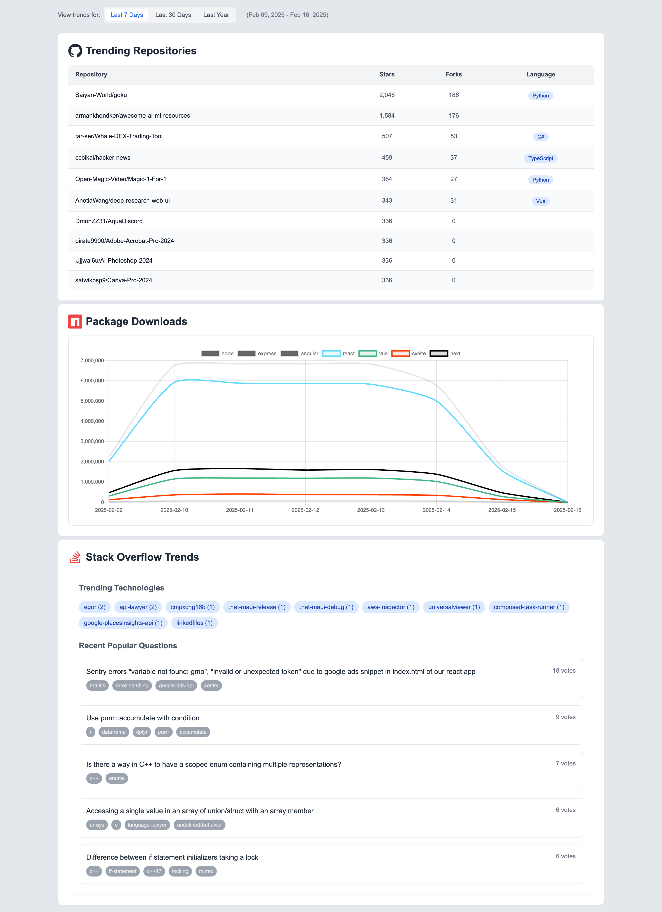

# DevTrends Dashboard

[](https://your-vercel-app-url.vercel.app)
[](https://nextjs.org)
[](https://opensource.org/licenses/MIT)

A real-time developer trends **[dashboard](https://devtrends.vercel.app/)** aggregating data from GitHub, npm, and Stack Overflow.



## Features

🔍 **Trend Discovery**

- Real-time GitHub trending repositories
- npm package download comparisons
- Timeframe filters (7d/30d/1y)
- Regional trend filtering

📊 **Data Visualization**

- Interactive charts (Chart.js)
- Responsive tables
- Language popularity badges
- Download trend comparisons

⚡ **Modern Tech Stack**

- Next.js 14 App Router
- TypeScript
- Tailwind CSS
- React Query (Data fetching)
- Vercel Hosting

## Getting Started

### Prerequisites

- Node.js 18+
- npm 9+
- GitHub Personal Access Token

### Installation

```bash
# Clone repository
git clone https://github.com/imay-dev/devtrends.git

# Install dependencies
npm install

# Create environment file
cp env.example .env.local
```
